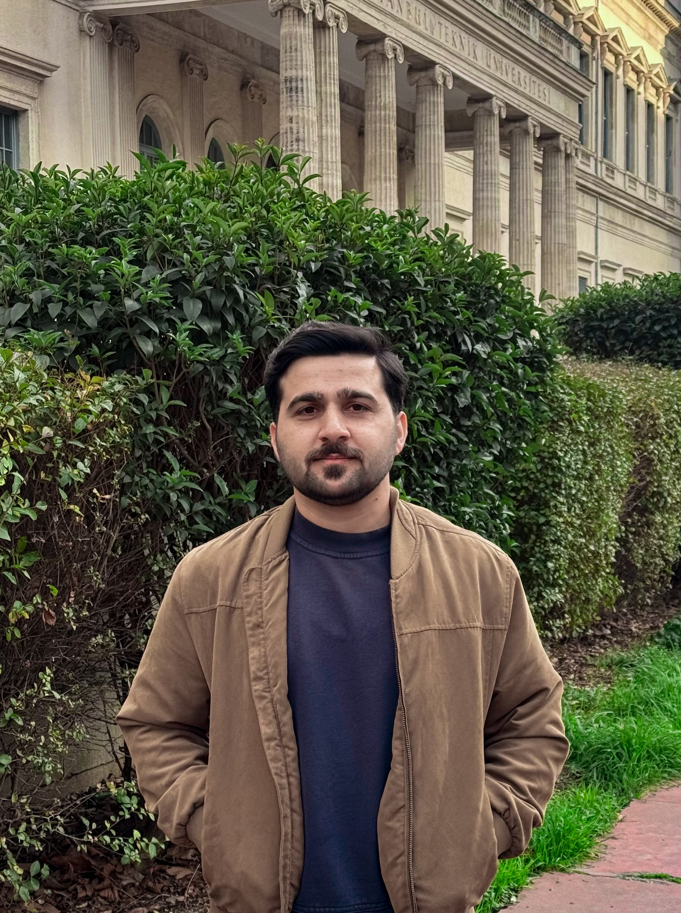

# Azmat Ullah Khan — Portfolio Website

A static, responsive personal research portfolio designed for GitHub Pages. It uses only HTML, CSS, and JavaScript—no installation, Jekyll, Node.js, or build process required.

## Before publishing

Search for the following placeholders in `index.html` and replace them:

1. `your.email@example.com` — your actual contact email.
2. `assets/documents/Azmat_Ullah_Khan_CV.pdf` — upload your CV under this exact file name, or edit the link.
3. `Add DOI`, `Add project page`, and all placeholder publication information.
4. The profile-photo placeholder in the `#about` section.
5. The four abstract project image blocks. You can replace their backgrounds with real project images later.

## Add your photo

1. Upload a photo as `assets/images/profile.jpg`.
2. In `index.html`, find this block:

```html
<div class="portrait-placeholder" role="img" aria-label="Placeholder for Azmat Ullah Khan profile photograph">
```

3. Replace it with:

```html

```

4. Add this CSS to the end of `assets/css/style.css`:

```css
.profile-photo {
  width: 100%;
  aspect-ratio: .84;
  object-fit: cover;
  border-radius: 15px;
}
```

## Replace a project visual

1. Upload an image to `assets/images`, for example: `fontan-pinn.png`.
2. Find the project link beginning with:

```html
<a class="project-image image-fontan"
```

3. Replace the class-based visual with an image element, for example:

```html
<a class="project-image real-image" href="projects/fontan-pinn.html">
  
  <span class="image-kicker">Computational hemodynamics</span>
</a>
```

4. Add this CSS:

```css
.real-image { padding: 0; }
.real-image img { width: 100%; height: 100%; object-fit: cover; }
.real-image .image-kicker { position: absolute; top: 18px; left: 18px; }
``


